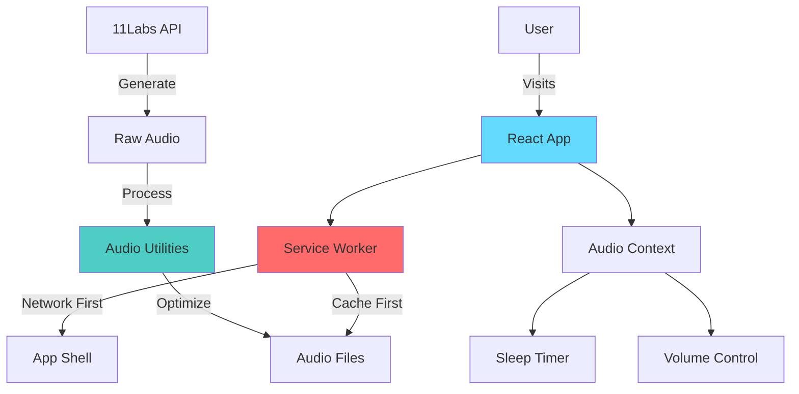

<div align="center">
  <h1>🧘 Breathe</h1>
  <p><strong>A mindful meditation experience for better sleep and relaxation</strong></p>
  
  <p>
    
    
    
    
  </p>

  <p>
    <a href="#-features">Features</a> •
    <a href="#-demo">Demo</a> •
    <a href="#-quick-start">Quick Start</a> •
    <a href="#-tech-stack">Tech Stack</a> •
    <a href="#-architecture">Architecture</a>
  </p>
</div>

---

## ✨ Features

### 🎯 Core Experience
- **🌙 Sleep Mode** - Drift into peaceful sleep with calming narration
- **🧘 Relax Mode** - Quick meditation sessions for stress relief
- **⏱️ Smart Timer** - Automatic shutdown after you fall asleep
- **🎙️ Multiple Narrators** - Choose your preferred meditation guide

### 📱 Progressive Web App
- **💾 Offline First** - Works without internet connection
- **📲 Installable** - Add to home screen like a native app
- **🔔 Background Audio** - Continues playing when screen is off
- **♾️ Seamless Updates** - Auto-updates without app store delays

### 🎨 Thoughtful Design
- **🌑 Dark Theme** - Easy on the eyes for nighttime use
- **📱 Responsive** - Beautiful on phones, tablets, and desktops
- **⚡ Performance** - Optimized audio loading and caching
- **♿ Accessible** - Keyboard navigation and screen reader support

## 🚀 Demo

<div align="center">
  <table>
    <tr>
      <td align="center">
        <strong>Sleep Mode</strong><br>
        
      </td>
      <td align="center">
        <strong>Relax Mode</strong><br>
        
      </td>
    </tr>
  </table>
</div>

## 🏃 Quick Start

```bash
# Clone the repository
git clone https://github.com/yourusername/sleep.git

# Install dependencies
cd sleep && npm install

# Start development server
npm start

# Build for production
npm run build
```

Visit `http://localhost:3000` to see the app in action! 🎉

## 🛠️ Tech Stack

### Frontend
- **React 18** - UI library with hooks and context
- **Material-UI v5** - Component library with theming
- **Service Workers** - Offline functionality and caching
- **Web Audio API** - Advanced audio control

### Audio Pipeline
- **11Labs** - AI voice generation
- **FFmpeg** - Audio optimization
- **Python Scripts** - Automated audio analysis
- **Adaptive Bitrate** - Smart quality based on connection

### Infrastructure
- **Netlify** - Global CDN and instant deploys
- **GitHub Actions** - CI/CD pipeline
- **Lighthouse** - Performance monitoring
- **Sentry** - Error tracking (optional)

## 🏗️ Architecture



## 📂 Project Structure

```
sleep/
├── 📱 src/                    # React application
│   ├── components/           # UI components
│   │   ├── AudioPlayer.js   # Main player logic
│   │   ├── AboutModal.js    # Information modal
│   │   └── audioPlayer/     # Player subcomponents
│   ├── styles/              # CSS modules
│   └── service-worker.js    # PWA functionality
│
├── 🎵 public/                 # Static assets
│   ├── peter-sleep.mp3      # Sleep meditation
│   ├── peter-relax.mp3      # Relaxation audio
│   └── manifest.json        # PWA manifest
│
├── 🔧 audio-utilities/        # Audio processing tools
│   ├── analyze_audio.py     # File analysis
│   └── pyproject.toml       # Python dependencies
│
└── 📄 docs/                   # Documentation
    ├── method.md            # Development methodology
    └── scripts/             # Meditation scripts
```

## 🧪 Development

### Testing
```bash
# Run unit tests
npm test

# Run with coverage
npm test -- --coverage

# E2E tests (coming soon)
npm run test:e2e
```

### Audio Optimization
```bash
# Analyze audio files
cd audio-utilities
uv run python analyze_audio.py ../public/peter-sleep.mp3

# Batch process all audio
uv run python analyze_audio.py
```

### Performance
- **Lighthouse Score**: 95+ across all metrics
- **First Paint**: <1.5s on 3G
- **Audio Load**: Progressive with range requests
- **Cache Strategy**: Network-first for app, cache-first for audio

## 🚢 Deployment

### Netlify (Recommended)
```yaml
# netlify.toml
[build]
  command = "npm run build"
  publish = "build"

[[headers]]
  for = "/*.mp3"
  [headers.values]
    Cache-Control = "public, max-age=31536000"
```

### Docker
```dockerfile
FROM node:18-alpine
WORKDIR /app
COPY package*.json ./
RUN npm ci --only=production
COPY . .
RUN npm run build
EXPOSE 3000
CMD ["npx", "serve", "-s", "build"]
```

## 🤝 Contributing

We welcome contributions! Please see our [Contributing Guide](CONTRIBUTING.md) for details.

### Development Workflow
1. Fork the repository
2. Create a feature branch (`git checkout -b feature/amazing-feature`)
3. Commit your changes (`git commit -m 'Add amazing feature'`)
4. Push to the branch (`git push origin feature/amazing-feature`)
5. Open a Pull Request

## 📄 License

This project is licensed under the MIT License - see the [LICENSE](LICENSE) file for details.

---

<div align="center">
  <p>Built with ❤️ for better sleep and mindfulness</p>
  <p>
    <a href="https://github.com/yourusername/sleep">GitHub</a> •
    <a href="https://breathe.app">Live Demo</a> •
    <a href="https://twitter.com/yourusername">Twitter</a>
  </p>
</div>